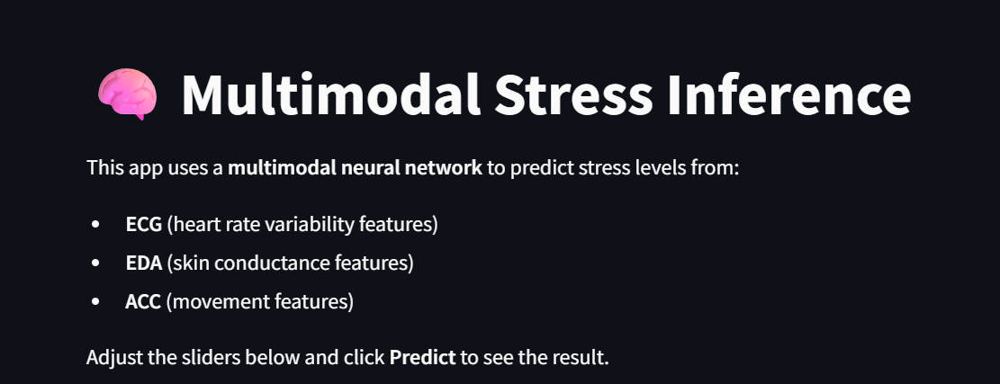
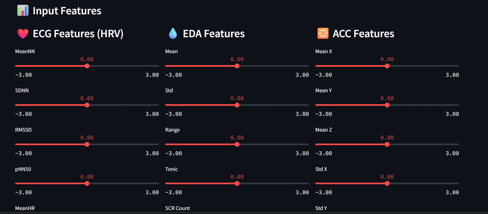
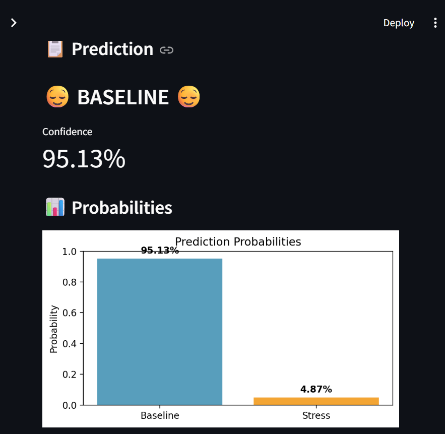

# 🧠 Multimodal Stress Inference

End-to-end pipeline for stress detection from ECG, EDA, and ACC signals.

## 📸 Demo





The model correctly identifies a **BASELINE** state with **95.13% confidence**.

## What It Does
- Takes ECG (heart), EDA (skin sweat), and ACC (movement) signals
- Extracts 18 features (HRV, skin conductance, motion)
- Uses a multimodal neural network with separate "brains" for each sensor
- Deploys as a FastAPI + Streamlit dashboard

## Run It
```bash
pip install -r requirements.txt
python -m src.preprocess
python -m src.train
python -m src.onnx_export
python -m src.api
streamlit run src/dashboard.py


Tech Stack
PyTorch · ONNX · FastAPI · Streamlit · scikit-learn

Results
Inference: <1 ms per sample (ONNX)

Evaluation: Leave-One-Subject-Out cross-validation

Ablation studies prove all 3 sensors are useful

Author
[Amanuel Wondimu]